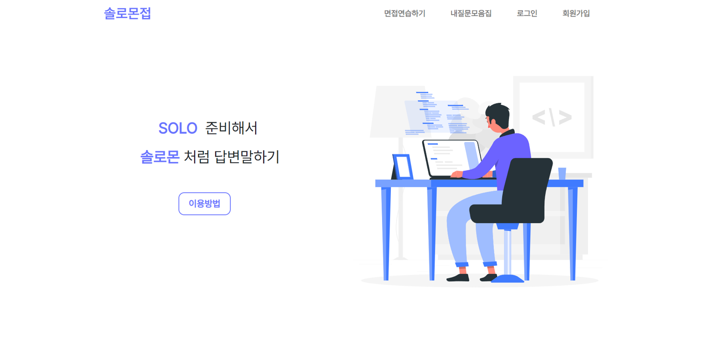
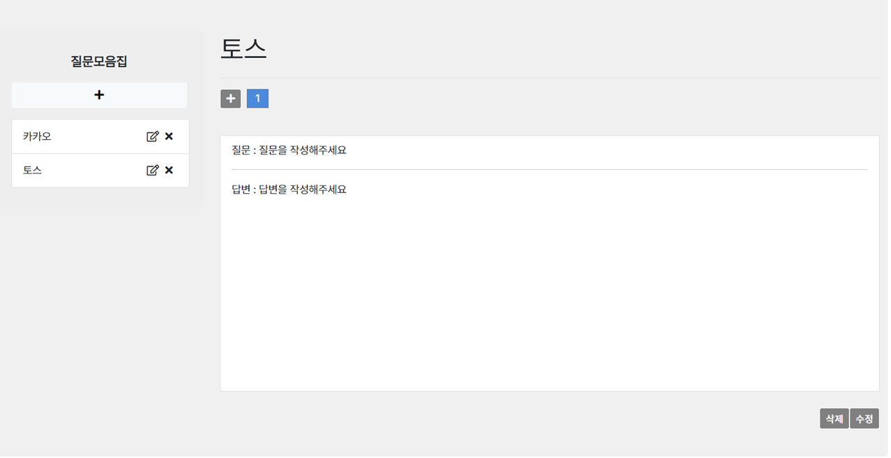
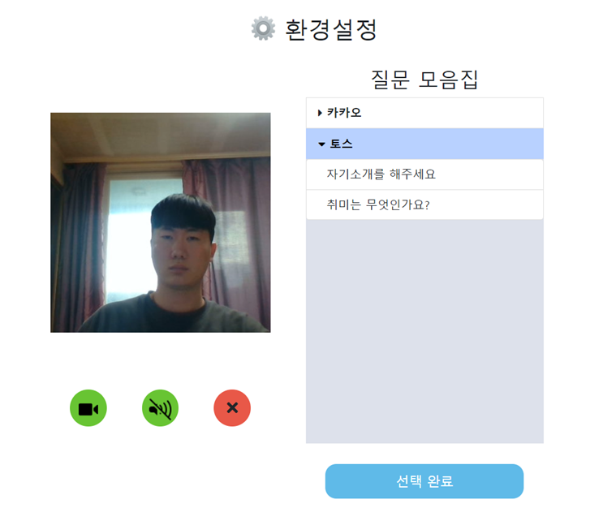
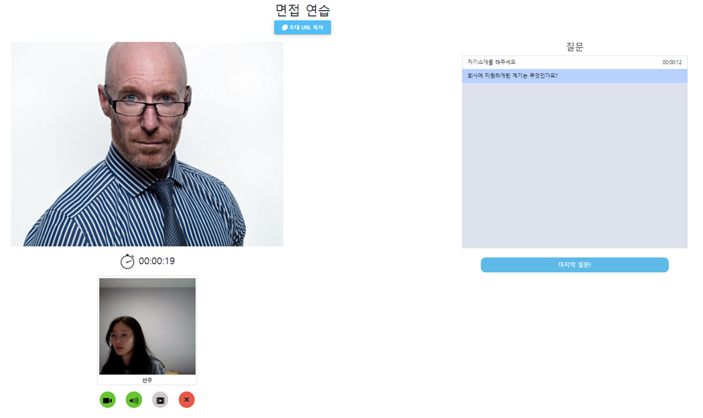
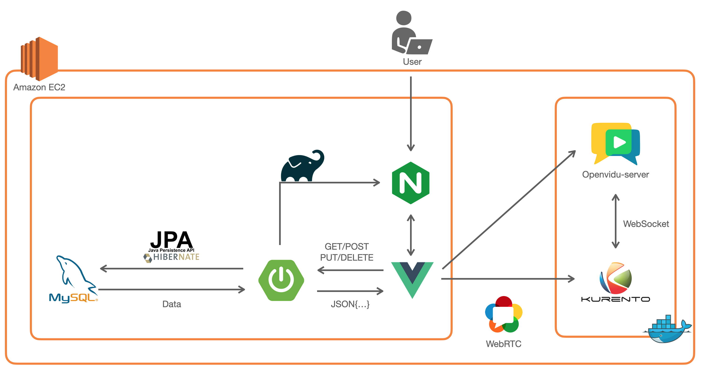
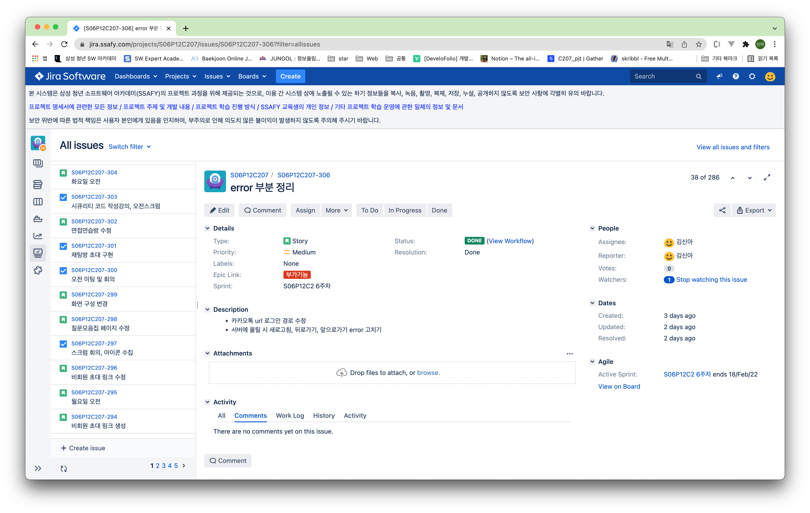
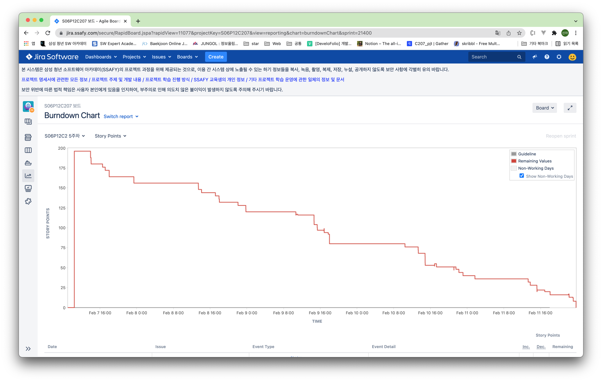

### 🖌️ 솔로몬접 소개

------

- 개발 기간 : 2022. 01. 10 ~ 2022. 02. 18 (6 weeks)
- 개발 인원 : 이주용, 김도연, 김신아, 노건우, 황선주
- 주제 : 면접에 어려움을 겪고 있는 IT 취업준비생을 위한 화상 면접 서비스


### 👨‍👩‍👦 역할 및 팀원 소개

------

| Name     | 이주용                                         | 김도연                                 | 김신아                                       | 노건우                               | 황선주                                         |
| -------- | ---------------------------------------------- | -------------------------------------- | -------------------------------------------- | ------------------------------------ | ---------------------------------------------- |
| Profile  |                           |                   |                         |                 |                           |
| Position | 팀장 & Frontend                                | Backend                                | Backend                                      | Frontend                             | Backend                                        |
| Git      | @[leejuyong12](https://github.com/leejuyong12) | @[kid-owo](https://github.com/kid-owo) | @[dodssockii](https://github.com/dodssockii) | @[rogonu](https://github.com/rogonu) | @[hwangseonju](https://github.com/hwangseonju) |


### ✨ 핵심 기능

------










### 🛠️ 기술 스택

------

#### Back-End

#####      

#### Front-End

    

#### Tool

     

#### Architecture




<details>
<summary>Back-end 기술 스택 보기</summary>
<div markdown="1">

- Spring-Boot : 2.4.0
- Spring-Boot-Data-JPA
- Spring-Boot-Starter-JDBC
- Spring Security
- Spring-Boot-Starter-thymeleaf
- lombok
- mysql
- jjwt : 0.11.2
- Spring-Boot-Starter-Mail
- Swagger : 2.3.0 
- Openvidu-java-client : 2.20.0
- Openvidu-test-browsers : 1.0.0

</div>
</details>

<details>
<summary>Front-end 기술 스택 보기</summary>
<div markdown="1">

- JS
- HTML
- CSS
- Vue.js @3.2.29

라이브러리

- axios @0.25.0 : Promise 기반 HTTP 클라이언트
- bootstrap-vue @2.21.2
- Openvidu-bowser @2.20.0 : WebRTC 라이브러리
- eslint & prettier @6.7.2 : 협업을 위한 formatter 라이브러리
- Vuex @4.0.2

</div>
</details>


### 📜 형상관리 및 기획

------

#### Notion


#### Jira




#### Burndown Chart




#### ERD


| 구분           | 링크                                                         |
| -------------- | ------------------------------------------------------------ |
| Notion         | [notion](https://feline-pluto-dd6.notion.site/393ec2193d8d4ec2976a198e5b00a699) |
| Documents      | [PPT](./exec/광주_2반_C207_발표자료.pdf)                     |
| Git Convention | [notion-convention](https://feline-pluto-dd6.notion.site/branch-commit-convention-bc49a8657c5b4a9abfa97a9df1d98c89) |
| WireFrame      | [Oven](https://ovenapp.io/view/xq832UXEkW43RQMdULxiaBkPIe0sGuVc/) |


### ⚙️ 설정 및 실행

------

- 설치 환경

  -> AWS EC2 Linux, Docker, Docker-compose, IntelliJ IDEA 2021.3.1, Visual Studio Code

<details>
    <summary>1. Java8 버전 설치</summary>
    <div>

- Azul public key 추가
	
	 ```shell
    	$sudo apt-key adv --keyserver hkp://keyserver.ubuntu.com:80 --recv-keys 0x219BD9C9
   ```

- Azul respository 추가

  ```shell
  $sudo apt-add-repository 'deb http://repos.azulsystems.com/ubuntu stable main'
  ```

- zulu-8 설치

  ```shell
  $sudo apt-get update
  $sudo apt-get install zulu-8
  ```

- 환경변수 설정

  ```shell
  $cd /etc
  $sudo nano profile
  ```

  본인의 환경에 맞게 설정

</div>

</details>


<details>
    <summary>2. Docker & Docker-compose 설치</summary>
    <div>

- apt 패키기 인덱스 업데이트
  
  ```shell
  $sudo apt update && sudo apt upgrade
  ```
  
- 다운로드를 위한 Util 준비
  
  ```shell
  $sudo apt-get install \
  apt-transport-https \
  ca-certificates \
  curl \
  gnupg-agent \
  software-properties-common
  ```
  
- Docker GPG key 추가
  
  ```shell
  $curl -fsSL https://download.docker.com/linux/ubuntu/gpg | sudo apt-key add
  ```
  
- apt repo에 Docker 다운로드 경로 추가
  
  ```shell
  $sudo add-apt-repository "deb [arch=amd64] https://download.docker.com/linux/ubuntu bionic stable"
  ```
  
- Docker 다운로드 및 설치
  
  ```shell
  $sudo apt-cache policy docker-ce
  $sudo apt install docker-ce
  $sudo apt update
  ```
  
- sudo 없이 docker 사용을 위한 ubuntu user docker 그룹에 등록 후 서버 재부팅
  
  ```shell
  $sudo usermod -aG docker ubuntu
  $sudo reboot
  ```
  
- Ubuntu 계정 비밀번호 설정(기존에 설정하지 않았다면 수행)
  
  ```shell
  $sudo passwd ubuntu
  ```
  
- Docker-compose 설치
  
  ```shell
  $sudo curl -L https://github.com/docker/compose/releases/download/1.25.0-rc2/docker-compose-`uname -s`-`uname -m` -o /usr/local/bin/docker-compose
  ```
  
- 실행 권한 주기
  
  ```shell
  $sudo chmod +x /usr/local/bin/docker-compose
  ```
  
    

  </div>
  </details>


<details>
<summary>3. MySql 설치</summary>
<div>

- mysql server 설치

  ```shell
  $sudo apt update
  $sudo apt-get install mysql-server
  ```

- 대소문자 구별 default값 변경

  - msyql.cnf 파일에 ‘lower_case_table_names = 1’ 추가

  ```shell
  $sudo service mysql stop
  $sudo rm -rf /var/lib/mysql
  $sudo mkdir /var/lib/mysql
  $sudo chown mysql:mysql /var/lib/mysql
  $sudo chmod 700 /var/lib/mysql
  $cd /etc/mysql/mysql.conf.d
  $sudo nano mysqld.cnf
  ```

- mysql 서비스 재시작

  ```shell
  $sudo mysqld --defaults-file=/etc/mysql/my.cnf --initialize --lower_case_table_names=1 --user=mysql --console
  $sudo service mysql start
  ```

- 생성된 root의 비밀번호 검색

  ```shell
  $sudo grep 'temporary password' /var/log/mysql/error.log
  ```

- mysql 세션 접속해서 비밀번호 변경

  - 비밀번호를 변경해야 root 계정 접속 가능

  ```shell
  $sudo mysql -u root -p
  // password 입력
  > mysql : alter user 'root'@'localhost' identified by '새비밀번호 입력';
  ```

- 외부 접속 허용

  - 모든 IP 허용

    - mysql.cnf 파일에 ‘bind-address = 0.0.0.0’으로 수정하기 혹은 

      bind-address 주석처리하기 → 같은 결과

    ```shell
    $cd /etc/mysql/mysql.conf.d
    $sudo nano mysqld.cnf
    ```

  - 설정 적용을 위한 재시작

    ```shell
    $sudo service mysql restart
    ```

  - 사용자 계정 추가 

    - 사용자를 생성하고, 모든 권한(CRUD) 부여

    ```shell
    $sudo mysql -u root -p
    //password 입력
    > CREATE USER 'root'@'%' IDENTIFIED BY '새 비밀번호 입력';
    > GRANT ALL PRIVILEGES ON *.* TO 'root'@'%' WITH GRANT OPTION;
    > FLUSH PRIVILEGES;
    ```

- Public IP 조회하기

  ```shell
  $curl ifconfig.me
  ```


</div>
</details>

<details>
<summary>4. Nginx 설치 및 설정</summary>
<div>


- Nginx 설치 후 버전 확인

  ```shell
  $sudo apt install nginx
  $nginx -v
  ```

- Nginx 설치 확인

  ```shell
  $sudo service nginx status  
  ```

- Nginx 설정

  - 설정 파일 수정(/etc/nginx/sites-available/test.conf)

    ```shell
    $sudo vim test.conf
    ```

    ```
    server {
    
            server_name <도메인>;
            root /var/www/dist/;
            index index.html;
    
            location / {
                try_files $uri $uri/ /index.html;
            }
    
            location /api {
                proxy_pass http://localhost:8080;
                proxy_set_header X-Real-IP $remote_addr;
                proxy_set_header X-Forwarded-For $proxy_add_x_forwarded_for;
                proxy_set_header Host $http_host;
            }
    
            error_page 404 /404.html;
                location = /index.html {
            }
            error_page 500 502 503 504 /50x.html;
                location = /index2.html {
            }
    
    
        listen [::]:443 ssl ipv6only=on; # managed by Certbot
        listen 443 ssl; # managed by Certbot
        ssl_certificate /etc/letsencrypt/live/<도메인>/fullchain.pem; # managed by Certbot
        ssl_certificate_key /etc/letsencrypt/live/<도메인>/privkey.pem; # managed by Certbot
        include /etc/letsencrypt/options-ssl-nginx.conf; # managed by Certbot
        ssl_dhparam /etc/letsencrypt/ssl-dhparams.pem; # managed by Certbot
    
    }
    server {
        if ($host = <도메인>) {
            return 301 https://$host$request_uri;
        } # managed by Certbot
    
    
            listen 80 default_server;
            listen [::]:80 default_server;
    
            server_name <도메인>;
    
    
        return 404; # managed by Certbot
    }
    ```

- Nginx 설정 변경 후 syntax 검사

  ```shell
  $sudo nginx -t
  ```

- Nginx 설정 변경 후 재시작 필수

  ```shell
  $sudo service nginx restart 
  ```


</div>
</details>

<details>
<summary>5. Openvidu 설치 및 설정</summary>
<div>


- Openvidu Port 확보

 `22 TCP`, `80 TCP` , `443 TCP`, `3478 TCP+UDP`, 

  `40000~57000 TCP+UDP`, `57001~65535 TCP+UDP`

- Openvidu Install

```shell
$cd /opt   # openvidu는 /opt 디렉토리에 설치 권장

$sudo curl https://s3-eu-west-1.amazonaws.com/aws.openvidu.io/install_openvidu_latest.sh | sudo bash
```

- 설정 파일 수정 ( /opt/openvidu/.env)

```shell
$sudo vi .env
```

```
DOMAIN_OR_PUBLIC_IP=<Linux 서버의 public ip 주소 또는 도메인>
OPENVIDU_SECRET=<사용할 비밀번호 입력>
CERTIFICATE_TYPE=letsencrypt # default 값은 selfsigned지만 selfsigned 방식 사용시 보안 문제 di야기
							 # SSL 키가 있다면 owncert 방식으로 하되, /owncert 디렉토리 안에 키가 있어야 한다.
LETSENCRYPT_EMAIL=<이메일>
HTTP_PORT=80
HTTPS_PORT=443

# HTTP_PORT와 HTTPS_PORT는 letsencrypt 방식의 키를 발급 받기 전까진 기본 포트인 80, 443을 사용해야 합니다!
# 키를 발급받고 난 후부터는 포트 변경해도 무방합니다!
```

- Openvidu Server 실행

```shell
$sudo ./openvidu start
```

- Openvidu Server 동작 확인

  - Docker Container에 아래와 같이 올라와 있는지 확인

    `openvidu-coturn`, `kurento-media-server`, `openvidu-call`, `openvidu-proxy`,

    `openvidu-redis`, `openvidu-server`

  ```shell
  $ sudo docker ps
  ```

  ```
  CONTAINER ID   IMAGE                                 COMMAND                  CREATED        STATUS                  PORTS     NAMES
  1c2af864a37c   openvidu/openvidu-coturn:5.0.0        "docker-entrypoint.s…"   20 hours ago   Up 20 hours                       openvidu_coturn_1
  575695716b60   kurento/kurento-media-server:6.16.0   "/entrypoint.sh"         20 hours ago   Up 20 hours (healthy)             openvidu_kms_1
  9abf26e074bd   openvidu/openvidu-call:2.20.0         "docker-entrypoint.s…"   20 hours ago   Up 20 hours                       openvidu_app_1
  f222d92e2f00   openvidu/openvidu-proxy:7.0.0         "/docker-entrypoint.…"   20 hours ago   Up 20 hours                       openvidu_nginx_1
  09474b6ed7ec   openvidu/openvidu-redis:3.0.0         "docker-entrypoint.s…"   20 hours ago   Up 20 hours                       openvidu_redis_1
  8b27e879a593   openvidu/openvidu-server:2.20.0       "/usr/local/bin/entr…"   20 hours ago   Up 20 hours                       openvidu_openvidu-server_1
  ```

- Openvidu와 관련한 nginx 파일 설정 

  - 설정 파일 수정(/etc/nginx/sites-available/test.conf)

    ```
    server {
    
            server_name <도메인>;
    
            location / {
                proxy_pass http://localhost:8080;
            }
    
    
            location /openvidu {
                proxy_pass http://127.0.0.1:5443;
    		        proxy_set_header Upgrade $http_upgrade;
    		        proxy_set_header Connection 'upgrade';
    		        proxy_set_header Host $host;
    		        proxy_cache_bypass $http_upgrade;
    		   }
    
    
            location /dashboard {
                proxy_pass http://127.0.0.1:5443/dashboard;
    				}
    
    
            error_page 404 /404.html;
                location = /index.html {
            }
            error_page 500 502 503 504 /50x.html;
                location = /index2.html {
            }
    
    
        listen [::]:443 ssl ipv6only=on; # managed by Certbot
        listen 443 ssl; # managed by Certbot
        ssl_certificate /etc/letsencrypt/live/<도메인>/fullchain.pem; # managed by Certbot
        ssl_certificate_key /etc/letsencrypt/live/<도메인>/privkey.pem; # managed by Certbot
        include /etc/letsencrypt/options-ssl-nginx.conf; # managed by Certbot
        ssl_dhparam /etc/letsencrypt/ssl-dhparams.pem; # managed by Certbot
    
    }
    server {
        if ($host = <도메인>) {
            return 301 https://$host$request_uri;
        } # managed by Certbot
    
    
            listen 80 default_server;
            listen [::]:80 default_server;
    
            server_name <도메인>;
        return 404; # managed by Certbot
    }
    ```

- Nginx 수정 시 재시작 필수

```shell
$sudo service nginx restart 
```

- https://<DOMAIN_OR_PUBLIC_IP>/dashboard 정상 동작 확인

  User : OPENVIDUAPP

  Password : <.env에 설정한 OPENVIDU_SECRET 값>


</div>
</details>

<details>
<summary>6. Git repository clone</summary>
<div>

```shell
$git clone https://lab.ssafy.com/s06-webmobile1-sub2/S06P12C207.git
```

</div>
</details>

<details>
<summary>7. Backend Build</summary>
<div>


- spring boot 파일 build

```shell
in IntelliJ

gradle -> bootjar

in server
$java -jar test.jar
```

bootjar를 이용하여 빌드 하면 build 폴더가 생성된다.

/build/libs/test.jar 처럼 생성된 jar 파일을 서버에 올린 후

서버에서 $ java -jar test.jar를 이용하여 실행한다.

</div>
</details>


<details>
<summary>8. Frontend Build</summary>
<div>


- node package 설치

  ```shell
  $npm install
  ```

- vue 파일 build

  ```shell
  $npm run build
  ```

  dist 폴더가 생성된다. mobaxterm과 같은 프로그램이 없을 시에는 dist 폴더를 zip으로 압축하여 서버에서 압축을 해제하는 방식으로 진행한다.

  /var/www/ 디렉토리 밑에 /var/www/dist/ 와 같은 식으로 dist 폴더를 넣는다.

</div>
</details>

### 📂 디렉토리 구조

------

#### Back-end

- [보러가기 :heavy_check_mark:](./BE/README.md)

#### Front-end

- [보러가기 :heavy_check_mark:](./FE/README.md)

  
