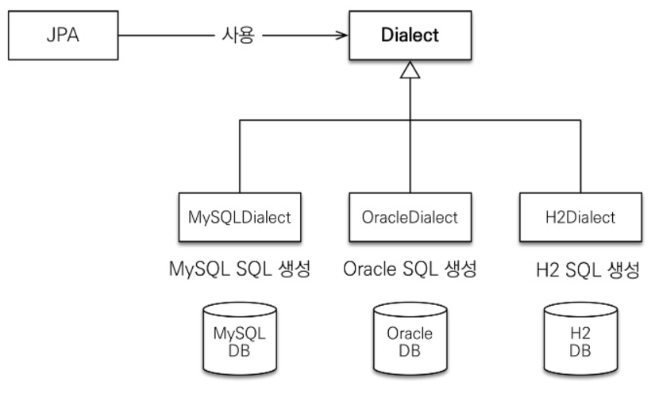
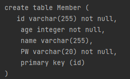
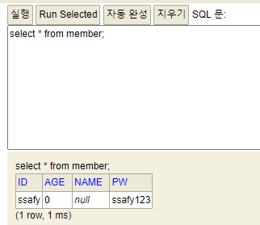

### JPA(Java Persistence API)

---


##### :one: SQL을 직접 다룰 때 발생하는 문제점

- 객체를 DB에 CRUD하려면 너무 많은 SQL과 JDBC API를 코드로 작성해야 함 -> 비슷한 일 반복 -> 지루함 + 생산성 감소
- DAO를 통해 어떤 SQL이 실행되고 있고, 어떠한 결과가 나오는지 일일이 확인해야함
- 강한 의존 관계 -> 연관성 증가
- 처음 실행하는 SQL에 따라 객체 그래프를 어디까지 탐색할 수 있는지 제한됨


##### :two: 패러다임 불일치

- 객체와 RDBMS가 지향하는 목적이 달라 둘의 기능과 표현 방법이 다름에서 발생하는 문제
- 객체 구조를 테이블 구조에 정하는데 한계가 존재함
- ex) 상속, 연관관계(객체=참조, 테이블=FK) 등


##### :three: JPA란?

- 자바 진영의 ORM 기술 표준
- 인터페이스의 모음!
- 자바 애플리케이션과 JDBC 사이에서 동작


##### :four: ORM이란?

- Object-Relational Mapping
- 객체는 객체대로, RDBMS는 RDBMS대로 설계 -> ORM 프레임워크가 중간에서 매핑
- 객체와 테이블을 매핑해서 **패러다임의 불일치 문제 해결**
- 하이버네이트 : 대부분의 패런다임 불일치 문제를 해결해주는 성숙한 ORM 프레임워크(가장 많이 사용)


##### :five: JPA 사용 이유

1. 생산성
   - 반복적인 작업(쿼리 작성+JDBC API 사용) 감소

2. 유지보수
   - 의존성 감소로 인해 수정할 코드 라인수 감소

3. 패러다임 불일치 해결
4. 성능
   - 애플리케이션과 DB 사이에서 다양한 성능 최적화 기회 제공
5. 데이터 접근 추상화와 벤더 독립성
   - 애플리케이션과 DB 사이에 추상화된 데이터 접근 계층 제공 -> 특정 DB 기술에 종속되지않음


##### :six: JPA가 제공하는 CRUD API

1. 저장 기능
   - persist() : 객체를 DB에 저장, INSERT 쿼리
2. 조회 기능
   - find() : 객체 하나를 DB에서 조회, SELECT 쿼리
3. 수정 기능
   - 별도의 수정 메소드 제공하지 않음
   - 객체를 조회해서 값을 변경하면 트랜잭션을 커밋할 때 DB에 적절한 UPDATE 쿼리 전달
4. 연관 객체 조회
5. 삭제
   - remove() : DB에서 객체 삭제, DELETE 쿼리


:seven: JPA의 성능 최적화 기능

- 1차 캐시와 동일성 보장 : 같은 트랜잭션 안에서는 같은 엔티티 반환 -> 조회 기능 향상
- 트랜잭션을 지원하는 쓰기 지연
- 지연 로딩(Lazy Loading) : 객체가 실제 사용될 때 로딩됨(객체를 가져온다고 해서 쿼리가 바로 실행되는게 아님!)


### JPA 기초 & 매핑

---


##### :one: 객체 매핑하기

- @Entity : JPA가 관리할 객체 (엔티티)
- @Id : DB PK와 매핑할 필드

[ JPA ]

```java
@Entity
public class Member {
	
	@Id
	private String id;
	private String password;
	
}
```

[ SQL 결과 ]

```sql
create table User {
	id varchar(255),
	password varchar(255),
	primary key(id)
}
```


##### :two: persistence.xml

- JPA 설정 파일
- 위치 : /META-INF/persistence.xml


##### :three: DB 방언

- JPA는 특정 DB에 종속적이지 않은 기술
- 각 DB가 제공하는 SQL 문법과 함수가 조금씩 다름




##### :four: 애플리케이션 개발

1. 엔티티 매니저 팩토리 설정
   - 엔티티 매니저 팩토리는 하나만 생성해서 애플리케이션 전체에 공유해야됨
2. 엔티티 매니저 설정
   - 엔티티 메니저는 스레드 간에 공유하면 안됨(사용하고 버리기!)
3. 트랜잭션
   - JPA의 모든 데이터 변경 발생하는 곳
4. 비즈니스 로직(CRUD)


### 필드와 컬럼 매핑

---


##### :one: DB 스키마 자동 생성

- DDL을 애플리케이션 실행 시점에 자동 생성
- 테이블 중심 -> 객체 중심
- DB 방언을 활용해 DB에 맞는 적절한 DDL 생성 -> 생성된 DDL은 **개발 장비에서만 사용**
- 생성된 DDL은 운영서버에서는 사용하지않거나 적절히 다듬은 후 사용


##### :two: DB 스키마 자동 생성 기능 (hibernate.hbm2ddl.auto)

- create : 기존테이블 삭제 후 다시 생성(DROP + CREATE)
- create-drop : create와 같으나 <u>종료시점에 테이블 DROP</u>
- update : 변경된 부분만 반영(운영DB에는 사용X)
- validate : 엔티티와 테이블이 정상 매핑되어있는지만 확인
- none : 사용하지 않음


​	:hand: <span style="color:red">주의사항</span>

		- 운영장비에서는 절대 create, create-drop, update 사용하면 안됨!

		- 개발 초기 단계 : create OR update
		- 테스트 서버 : update OR validate
		- 스테이징과 운영 서버 : validate OR none


##### :three: 매핑 어노테이션

- @Column(value ="값 지정") : 테이블 컬럼과 객체를 매핑
  - name : 객체명과 별개로 테이블 컬럼명 따로 지정
  - insertable, updateable : 읽기 전용
  - nullable : null 허용여부 결정, DDL 생성시 사용(not null 설정하는것)
  - upique : 유니크 제약 조건, DDL 생성시 사용
  - columnDefinition, length, precision, scale ...
- @Temporal(TemporalType.value) : 시간 기능 지원
  - TIMESTAMP : 날짜 + 시간
  - DATE : 날짜
  - TIME : 시간
- @Enumerated (EnumType.value) : 열거형 매핑, value는 STRING을 적극 권장함 why? 수정시 꼬이게 될 수 있음..
  - ORDINAL : 순서를 저장(default)
  - STRING(권장) : 열거형 이름을 그대로 저장
- @Lob : CLOB, BLOB 매핑
  - CLOB : String, char[]..
  - BLOB : byte[]..
- @Transient : 해당 필드는 매핑하지않음, 애플리케이션에서 DB에 저장하지않는 필드

[ 실습 ]

```java
@Entity
public class Member {

    @Id @GeneratedValue(strategy = GenerationType.AUTO)	// 값 자동 생성
    private int idx;
    private String id;
    @Column(name = "PW", nullable = false, length = 20)	// 컬럼명은 PW, not null 제약조건 추가, 길이는 20
    private String password;
    private String name;
    private int age;

    public int getIdx() {
        return idx;
    }

    public void setIdx(int idx) {
        this.idx = idx;
    }

    public String getId() {
        return id;
    }

    public void setId(String id) {
        this.id = id;
    }

    public String getPassword() {
        return password;
    }

    public void setPassword(String password) {
        this.password = password;
    }

    public String getName() {
        return name;
    }

    public void setName(String name) {
        this.name = name;
    }

    public int getAge() {
        return age;
    }

    public void setAge(int age) {
        this.age = age;
    }
```

```java
 		// hello라는 persistence-name으로 설정한다는 의미
        EntityManagerFactory emf = Persistence.createEntityManagerFactory("hello");

        EntityManager em = emf.createEntityManager();
        EntityTransaction tx = em.getTransaction();    // 트랜잭션 얻어오기
        tx.begin();     // 트랜잭션 시작

        try {
            // 등록
            Member member = new Member();
            member.setId("ssafy");
            member.setPassword("ssafy123");

            em.persist(member);     // 저장
            tx.commit();            // 커밋
        } catch (Exception e) {
            tx.rollback();
        } finally {
            em.close();
        }
        emf.close();
```




[ 결과 ]




##### :four: 식별자 매핑 어노테이션

- @Id @GeneratedValue(stratey = GenerationType.value)
  - IDENTITIY : DB에 위임, MYSQL 
  - SEQUENCE : DB 시퀀스 오브젝트 사용, ORACLE ( @SequenceGenerator 필요 )
  - TABLE : 키 생성용 테이블 사용, 모든 DB 사용 가능 ( @TableGenerator 필요 )
  - AUTO : DB 방언에 따라 자동 지정(위의 3가지 중 하나를 자동 지정해줌), DEFAULT


### :star:연관관계 매핑:star: 

---


##### :one: 단방향 매핑(연관관계 O)

- @ManyToOne : 다대일 관계에서 사용
- @JoinColumn : FK를 매핑할 때 사용

[ 실습 ]

```java
@Entity
public class Member {

    @Id @GeneratedValue
    private int id;

    @Column(name = "USERNAME")
    private String name;
    private int age;

    @ManyToOne(fetch = FetchType.LAZY)
    //@JoinColumn(name = "TEAM_ID", referencedColumnName = "id")	// JoinColumn은 생략가능한 어노테이션이지만 현재 사용하면 오류 발생..
    private Team team;

//    @Column(name = "TEAM_ID")
//    private int teamId;

    public int getId() {
        return id;
    }

    public void setId(int id) {
        this.id = id;
    }

    public String getName() {
        return name;
    }

    public void setName(String name) {
        this.name = name;
    }

    public int getAge() {
        return age;
    }

    public void setAge(int age) {
        this.age = age;
    }

    public Team getTeam() {
        return team;
    }

    public void setTeam(Team team) {
        this.team = team;
    }
}
```

```java
@Entity
public class Team {

    @Id @GeneratedValue
    private int id;
    private String name;

    public int getId() {
        return id;
    }

    public void setId(int id) {
        this.id = id;
    }

    public String getName() {
        return name;
    }

    public void setName(String name) {
        this.name = name;
    }
}
```

```java
public class Main {

    public static void main(String[] args) {
        // hello라는 persistence-name으로 설정한다는 의미
        EntityManagerFactory emf = Persistence.createEntityManagerFactory("hello");

        EntityManager em = emf.createEntityManager();
        EntityTransaction tx = em.getTransaction();    // 트랜잭션 얻어오기
        tx.begin();     // 트랜잭션 시작

        try {
            // 팀 저장
            Team team = new Team();
            team.setName("teamA");
            em.persist(team);

            // 회원 저장
            Member member = new Member();
            member.setName("test");
            member.setTeam(team);   // 단방향 연관관계 설정, 참조 저장
            em.persist(member);
            
            em.flush();     // DB에 쿼리 전송
            em.clear();     // 캐쉬 비우기

            // 회원 조회
            Member findMember = em.find(Member.class, member.getId());
            // 참조를 사용해서 연관관계 조회
            Team findTeam = findMember.getTeam();

            findTeam.getName();

            tx.commit();            // 커밋
        } catch (Exception e) {
            tx.rollback();
        } finally {
            em.close();
        }
        emf.close();
    }
}
```


[ 결과 ]


