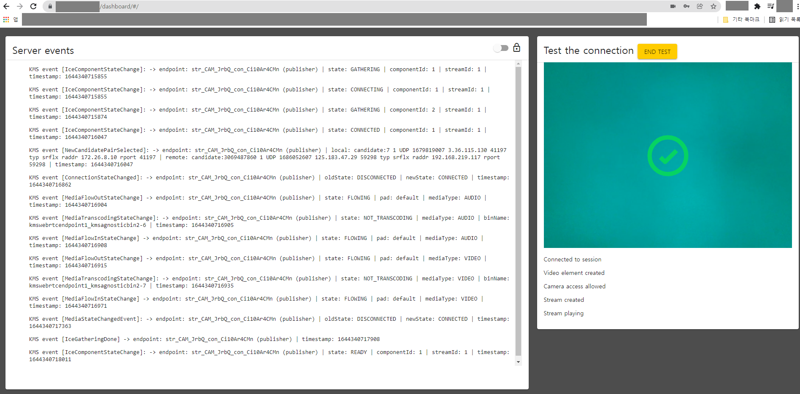

# Openvidu

- openvidu server 설정 관련 사이트

[https://github.com/483759/Square4Us/wiki/Openvidu-구축-과정](https://github.com/483759/Square4Us/wiki/Openvidu-%EA%B5%AC%EC%B6%95-%EA%B3%BC%EC%A0%95)

[https://velog.io/@kimyunbin/Openvidu-커스터마이징-하기](https://velog.io/@kimyunbin/Openvidu-%EC%BB%A4%EC%8A%A4%ED%84%B0%EB%A7%88%EC%9D%B4%EC%A7%95-%ED%95%98%EA%B8%B0)

[https://whatisthenext.tistory.com/123](https://whatisthenext.tistory.com/123)

- openvidu 설정 파일
    - /etc/nginx/sites-available/test.conf
      
        ```
        server {
        
                server_name i6c207.p.ssafy.io;
        
                # spring-boot 서버 설정에 사용하세요.
                # 포트는 수정가능합니다.
                location / {
                #   proxy_pass http://127.0.0.1:8080;
                    proxy_pass http://localhost:8080;
                }
        
                # 여기에 경로를 다른것으로 설정해서 사용하는게 좋을것 같습니다.
                # ex) location /openvidu
                # 위 예제처럼 설정하게 되면 https://i6c207.p.ssafy.io/openvidu로 접속하면
                # 도커의 5443 포트로 이동하게 됨. (현재 openvidu 포트)
                location /openvidu {
                    proxy_pass http://127.0.0.1:5443/;
                }
        
                location /dashboard {
                    proxy_pass http://127.0.0.1:5443/dashboard;
                }
        
                # 에러 페이지 location 수정 필요.
                error_page 404 /404.html;
                    location = /index.html {
                }
                error_page 500 502 503 504 /50x.html;
                    location = /index2.html {
                }
        
            listen [::]:443 ssl ipv6only=on; # managed by Certbot
            listen 443 ssl; # managed by Certbot
            ssl_certificate /etc/letsencrypt/live/i6c207.p.ssafy.io/fullchain.pem; # managed by Certbot
            ssl_certificate_key /etc/letsencrypt/live/i6c207.p.ssafy.io/privkey.pem; # managed by Certbot
            include /etc/letsencrypt/options-ssl-nginx.conf; # managed by Certbot
            ssl_dhparam /etc/letsencrypt/ssl-dhparams.pem; # managed by Certbot
        
        }
        server {
            if ($host = i6c207.p.ssafy.io) {
                return 301 https://$host$request_uri;
            } # managed by Certbot
        
                listen 80 default_server;
                listen [::]:80 default_server;
        
                server_name i6c207.p.ssafy.io;
            return 404; # managed by Certbot
        }
        ```
        
    - /opt/openvidu/.env
    
    ```
    DOMAIN_OR_PUBLIC_IP=127.0.0.1
    OPENVIDU_SEVRET=dashboard비밀번호
    CERTIFIVATE_TYPE=selfsigned
    정확히는 모르겟으나 인증서에 따라 달라짐
    주석 세가지 중에 각각 선택해서 적어줌
    
    HTTP__PORT=80
    HTTPS_PORT=5443
    ```
    
    nginx 수정
    sudo service nginx restart 를 해줘야 설정 완료
    
- kurento media server 실행
  
    
    
- openvidu-server를 실행하려고 보니 slf4j관련한 오류가 있다.

예측컨데, 얼마전 있던 log4j와 관련하여 의존성을 주입해주어야 하지 않을까...


https://mvnrepository.com/artifact/org.slf4j/slf4j-api 를통하여 의존성 주입

```
<!-- <https://mvnrepository.com/artifact/org.slf4j/slf4j-api> -->
<dependency>
    <groupId>org.slf4j</groupId>
    <artifactId>slf4j-api</artifactId>
    <version>1.7.25</version>
</dependency>
```

의존성을 주입하면 다른 에러가 나온다....


- 다른 방식으로는 openvidu-tutorial을 진행하면 된다. 이는 공식사이트가 더 정확하게 나와있다.

[https://docs.openvidu.io/en/stable/tutorials/openvidu-insecure-vue/](https://docs.openvidu.io/en/stable/tutorials/openvidu-insecure-vue/)